# 🍜 RAOTA (라오타) Database ERD & Schema Documentation

라오타 모바일 애플리케이션의 프론트엔드 도메인 인터페이스 및 비즈니스 요구사항을 기반으로 설계된 표준 관계형 데이터베이스(RDB) 스키마 명세서입니다.

---

## 1. 개체 관계도 (Entity Relationship Diagram)

```mermaid
erDiagram
    USERS ||--o{ RAMEN_LOGS : "기록 작성"
    USERS ||--o{ COMMUNITY_POSTS : "게시글 작성"
    USERS ||--o{ COMMUNITY_COMMENTS : "댓글 작성"
    USERS ||--o{ USER_DEVICES : "디바이스 토큰 보유"
    USERS ||--o{ NOTIFICATIONS : "알림 수신"
    USERS ||--o| NOTIFICATION_SETTINGS : "알림 환경설정"
    USERS ||--o{ SHOP_BOOKMARKS : "관심 매장 저장"
    USERS ||--o{ USER_TASTE_REPORTS : "취향 리포트 보유"
    USERS ||--o{ RAMEN_LOG_LIKES : "로그 공감"
    USERS ||--o{ COMMUNITY_POST_LIKES : "게시글 좋아요"

    SHOPS ||--o{ RAMEN_LOGS : "매장 로그"
    SHOPS ||--o{ COMMUNITY_POSTS : "연관 매장 태그"
    SHOPS ||--o{ SHOP_BOOKMARKS : "북마크 유저"

    RAMEN_LOGS ||--o{ RAMEN_LOG_IMAGES : "다중 사진"
    RAMEN_LOGS ||--o{ RAMEN_LOG_TASTE_NOTES : "5축 미각 노트"
    RAMEN_LOGS ||--o{ RAMEN_LOG_LIKES : "공감 기록"

    COMMUNITY_POSTS ||--o{ COMMUNITY_COMMENTS : "댓글 목록"
    COMMUNITY_POSTS ||--o{ COMMUNITY_POST_LIKES : "좋아요 기록"
    COMMUNITY_COMMENTS ||--o{ COMMUNITY_COMMENTS : "대댓글 계층 구조 (parent_id)"

    USERS {
        bigint id PK "회원 고유 ID"
        varchar oauth_provider "소셜 제공자 (KAKAO, APPLE, GOOGLE)"
        varchar oauth_id UK "소셜 인증 고유 식별자"
        varchar email "이메일"
        varchar nickname UK "활동 닉네임"
        varchar avatar_url "프로필 이미지 URL"
        varchar level_title "활동 등급명 (라멘 입문자, 라멘 미식가, 라멘 마스터 등)"
        int level_number "1~6 등급 번호"
        varchar membership_no UK "회원 고유 식별번호 (ROT-2026-XXXX)"
        text bio "한줄 소개글"
        varchar favorite_ramen_type "최애 라멘 종류 (쇼유, 돈코츠, 시오 등)"
        int log_count "누적 완식/라멘로그 그릇수"
        datetime created_at "가입 일시"
        datetime updated_at "정보 수정 일시"
    }

    SHOPS {
        bigint id PK "라멘 매장 고유 ID"
        varchar name "라멘집 상호명 (예: 멘야준, 세상끝의라멘)"
        varchar branch "지점 구분 (예: 망원 본점, 합정점)"
        varchar address "도로명 주소"
        decimal latitude "위도 좌표 (37.xxxx)"
        decimal longitude "경도 좌표 (126.xxxx)"
        varchar phone "매장 전화번호"
        decimal rating "별점 평점 (예: 4.8)"
        int review_count "누적 리뷰 개수"
        varchar business_status "영업 상태 (OPERATIONAL 등)"
        json opening_hours "요일별 영업시간 목록 (JSON)"
        varchar price_range "가격대 (예: 1~2만원대)"
        boolean dine_in "매장 내 식사 가능 여부"
        boolean delivery "배달 주문 지원 여부"
        varchar google_maps_uri "구글 지도 웹 링크"
        varchar instagram_url "공식 인스타그램 링크"
        varchar catch_table_url "캐치테이블 예약 링크"
        json service_perks "밥/면 리필, 와리스프 제공 혜택 정보 (JSON)"
        datetime created_at "매장 등록 일시"
        datetime updated_at "매장 정보 수정 일시"
    }

    RAMEN_LOGS {
        bigint id PK "라멘로그 고유 ID"
        bigint user_id FK "작성 회원 ID"
        bigint shop_id FK "방문 매장 ID"
        varchar menu_name "주문한 라멘 메뉴명 (예: 특제 쇼유 라멘)"
        varchar ramen_type "라멘 계열 분류 (쇼유, 돈코츠, 시오, 미소, 츠케멘 등)"
        date visited_at "실제 매장 방문 일자"
        varchar revisit "재방문 의사 (자주 감, 가끔 생각남, 한번이면 충분)"
        text note "식사 한줄평 및 상세 미식 메모"
        boolean is_public "전체 공개 피드 게시 여부"
        int like_count "공감(좋아요) 누적 수"
        datetime created_at "로그 작성 일시"
        datetime updated_at "로그 수정 일시"
    }

    RAMEN_LOG_IMAGES {
        bigint id PK "라멘 사진 ID"
        bigint ramen_log_id FK "연관 라멘로그 ID"
        varchar image_url "S3/CDN 업로드 사진 URL"
        int sort_order "스와이프 캐러셀 표시 순서 (0, 1, 2...)"
        datetime created_at "사진 업로드 일시"
    }

    RAMEN_LOG_TASTE_NOTES {
        bigint id PK "미각 노트 레코드 ID"
        bigint ramen_log_id FK "연관 라멘로그 ID"
        varchar category "5축 미각 축 분류 (broth: 국물, noodle: 면, seasoning: 간, topping: 토핑)"
        varchar note_value "선택한 미각 특징 태그 (예: 진해요, 부드러워요, 딱 좋아요, 차슈 좋아요)"
    }

    COMMUNITY_POSTS {
        bigint id PK "게시글 고유 ID"
        bigint user_id FK "작성 회원 ID"
        bigint shop_id FK "연관 라멘집 ID (선택 태그)"
        varchar category "게시판 카테고리 (REVIEW: 맛집후기, TIP: 꿀팁, QUESTION: Q&A, FREE: 자유)"
        varchar title "게시글 제목"
        text content "게시글 본문 내용"
        varchar image_url "대표 썸네일 이미지 URL (선택)"
        int view_count "게시글 조회수"
        int like_count "게시글 좋아요수"
        int comment_count "등록된 댓글수"
        datetime created_at "게시글 작성 일시"
        datetime updated_at "게시글 수정 일시"
    }

    COMMUNITY_COMMENTS {
        bigint id PK "댓글 고유 ID"
        bigint post_id FK "연관 게시글 ID"
        bigint user_id FK "댓글 작성 회원 ID"
        bigint parent_id FK "부모 댓글 ID (대댓글/답글인 경우 참조, 일반 댓글은 NULL)"
        text content "댓글 본문 텍스트"
        int like_count "댓글 좋아요수"
        datetime created_at "댓글 작성 일시"
        datetime updated_at "댓글 수정 일시"
    }

    USER_DEVICES {
        bigint id PK "디바이스 고유 ID"
        bigint user_id FK "소유 회원 ID"
        varchar fcm_token UK "Firebase Cloud Messaging 푸시 발송용 디바이스 토큰"
        varchar device_os "운영체제 구분 (IOS, ANDROID)"
        datetime last_login_at "해당 기기 최근 접속 일시"
    }

    NOTIFICATIONS {
        bigint id PK "알림 고유 ID"
        bigint user_id FK "수신 회원 ID"
        varchar type "알림 유형 (LIKE: 공감, COMMENT: 댓글, LEVEL: 승급, SHOP: 매장소식, NOTICE: 시스템공지)"
        varchar title "알림 제목"
        varchar content "알림 상세 내용 문구"
        varchar target_screen "탭했을 때 이동할 앱 내 화면 (lounge, shopDetail, tasteDetail 등)"
        bigint target_id "연관 대상 엔터티 ID (게시글 ID 또는 매장 ID)"
        boolean is_read "알림 확인/읽음 여부 (false: 안읽음, true: 읽음)"
        datetime created_at "알림 발생 및 수신 일시"
    }

    NOTIFICATION_SETTINGS {
        bigint user_id PK, FK "회원 ID (1:1 매핑)"
        boolean push_enabled "스마트폰 전체 푸시 알림 수신 동의 여부"
        boolean likes_enabled "내 라멘로그/글 공감 및 좋아요 알림 수신"
        boolean comments_enabled "내 게시글에 달린 댓글 알림 수신"
        boolean level_up_enabled "활동 등급 승급 축하 알림 수신"
        boolean shop_news_enabled "관심 라멘집 신메뉴/한정판 소식 알림 수신"
        datetime updated_at "설정 변경 일시"
    }

    SHOP_BOOKMARKS {
        bigint id PK "북마크 고유 ID"
        bigint user_id FK "저장한 회원 ID"
        bigint shop_id FK "관심 라멘 매장 ID"
        datetime created_at "북마크 저장 일시"
    }

    USER_TASTE_REPORTS {
        bigint id PK "리포트 고유 ID"
        bigint user_id FK "대상 회원 ID"
        varchar volume "정기호 타이틀 (예: Vol. 03)"
        varchar period_title "분석 기간 명칭 (예: 2026년 8월 정기호)"
        varchar style_title "미각 성향 대표 타이틀 (예: 청탕과 담백한 블렌딩파)"
        text quote "미식 분석 총평 한줄 요약"
        int record_count "분석에 반영된 누적 완식 그릇수"
        json radar_metrics "5축 미각 레이더 점수 (국물농도, 면경도, 염도, 감칠맛, 오일리치) (JSON)"
        json style_breakdown "상세 계열별 소비 비율 및 통계 (JSON)"
        datetime published_at "리포트 발행 일시"
    }

    RAMEN_LOG_LIKES {
        bigint id PK "로그 공감 기록 ID"
        bigint user_id FK "공감을 누른 회원 ID"
        bigint ramen_log_id FK "대상 라멘로그 ID"
        datetime created_at "공감 누른 일시"
    }

    COMMUNITY_POST_LIKES {
        bigint id PK "게시글 좋아요 기록 ID"
        bigint user_id FK "좋아요를 누른 회원 ID"
        bigint post_id FK "대상 커뮤니티 게시글 ID"
        datetime created_at "좋아요 누른 일시"
    }
```



---

## 2. 도메인별 상세 설계 메모 및 비즈니스 규칙

### 2.1 회원 & 인증 도메인 (`users`, `user_devices`)
* **OAuth 2.0 간편 로그인 연동**:
  - `oauth_provider` + `oauth_id` 복합 유니크 제약(`uk_oauth`)을 걸어 카카오/애플/구글 중복 가입을 방지합니다.
* **활동 등급 체계 (`level_title`, `level_number`)**:
  - 누적 완식 그릇수(`log_count`)에 따라 레벨이 승급됩니다.
  - 1레벨(라멘 입문자) ~ 6레벨(라멘 마스터) 등급 명칭이 캐싱되어 커뮤니티 피드 조회 성능을 높입니다.
* **멀티 디바이스 FCM 푸시 구조 (`user_devices`)**:
  - 1명의 사용자가 여러 대의 스마트폰(iPhone, iPad, 갤럭시 등)을 사용할 수 있으므로 1:N 관계로 설계되었습니다.
  - 사용자가 앱을 삭제하거나 로그아웃할 때 해당 `fcm_token`을 정리하거나 만료 처리합니다.

### 2.2 라멘 매장 도메인 (`shops`, `shop_bookmarks`)
* **지도 기반 지리 공간 쿼리 최적화**:
  - `latitude`, `longitude`에 인덱스(`idx_shop_geo`)를 생성하여 "내 위치 반경 3km 내 라멘집 찾기(Haversine 공식)"를 밀리초 단위로 조회합니다.
* **라멘 매니아 특화 혜택 (`service_perks`)**:
  - 라멘집마다 다른 특별 혜택(공깃밥 무료, 와리스프 제공, 면 리필 1회 무료, 갓김치/타카나 구비)을 JSON 포맷으로 유연하게 저장합니다.
* **관심 매장 중복 저장 방지 (`shop_bookmarks`)**:
  - `(user_id, shop_id)` 복합 유니크 제약(`uk_user_shop_bookmark`)을 통해 멱등성을 보장합니다.

### 2.3 라멘로그 & 취향 DNA 도메인 (`ramen_logs`, `ramen_log_images`, `ramen_log_taste_notes`)
* **방문 기록과 사진의 1:N 분리 (`ramen_log_images`)**:
  - 라오타 앱의 "풀와이드 다중 사진 스와이프 캐러셀"을 지원하기 위해 `sort_order` 필드로 사진 순서를 지정합니다.
* **5축 미각 노트 정규화 (`ramen_log_taste_notes`)**:
  - 국물(`broth`), 면(`noodle`), 간(`seasoning`), 토핑(`topping`)의 다중 선택 태그를 별도 테이블로 분리했습니다.
  - 마이페이지 "취향 리포트(레이더 차트) 및 완식 잔디" 산출 시 `GROUP BY category, note_value` 통계 쿼리를 초고속으로 수행할 수 있습니다.
* **공감 어뷰징 방지 (`ramen_log_likes`)**:
  - `(user_id, ramen_log_id)` 유니크 제약으로 중복 공감을 방지합니다.

### 2.4 커뮤니티 라운지 도메인 (`community_posts`, `community_comments`)
* **카테고리별 피드 분리**:
  - 맛집후기(`REVIEW`), 꿀팁(`TIP`), 질문답변(`QUESTION`), 자유수다(`FREE`)로 분류하며 `(category, created_at DESC)` 복합 인덱스로 탭 전환 시 빠른 렌더링을 지원합니다.
* **연관 라멘집 태그 연동 (`shop_id`)**:
  - 글 작성 시 매장을 선택하면 게시글 상단에 매장 칩 버튼이 노출되며, 탭 시 해당 매장 상세 화면으로 바로 이동합니다.
* **계층형 대댓글 구조 (`parent_id`)**:
  - 자기 참조(Self-Join) 외래키를 통해 1단계 답글(@닉네임 언급) 기능을 가볍고 직관적으로 지원합니다.

### 2.5 알림 센터 도메인 (`notifications`, `notification_settings`)
* **알림 영구 보관 정책**:
  - 삭제 기능 없이 모든 알림 히스토리가 시간 순으로 보관되며, 탭 시 `is_read = true`로 변경됩니다.
* **딥링크 라우팅 (`target_screen`, `target_id`)**:
  - 예: `target_screen = 'lounge'`, `target_id = 1`이면 알림 탭 시 해당 커뮤니티 게시글 상세 화면으로 자동 이동합니다.
* **푸시 발송 필터링 (`notification_settings`)**:
  - Spring Boot 서버에서 알림 이벤트가 발생했을 때, 수신자의 설정(`likes_enabled`, `comments_enabled` 등)을 검사한 뒤 동의한 경우에만 FCM 서버로 요청을 전송합니다.

---

## 3. MySQL / PostgreSQL 호환 DDL 스크립트 (한글 주석 완비)

```sql
-- ====================================================
-- 1. 회원 정보 테이블 (users)
-- ====================================================
CREATE TABLE users (
    id BIGINT AUTO_INCREMENT PRIMARY KEY COMMENT '회원 고유 식별자',
    oauth_provider VARCHAR(20) NOT NULL COMMENT '소셜 인증 제공자 (KAKAO, APPLE, GOOGLE)',
    oauth_id VARCHAR(100) NOT NULL COMMENT '소셜 인증 고유 ID',
    email VARCHAR(100) COMMENT '회원 이메일 주소',
    nickname VARCHAR(50) NOT NULL COMMENT '앱 내 활동 닉네임',
    avatar_url VARCHAR(500) COMMENT '프로필 이미지 URL',
    level_title VARCHAR(50) DEFAULT '라멘 입문자' COMMENT '활동 등급명 (라멘 입문자, 라멘 미식가, 라멘 마스터 등)',
    level_number INT DEFAULT 1 COMMENT '등급 번호 (1~6 레벨)',
    membership_no VARCHAR(30) NOT NULL COMMENT '회원 고유 멤버십 번호 (예: ROT-2026-0001)',
    bio TEXT COMMENT '프로필 한줄 소개글',
    favorite_ramen_type VARCHAR(50) COMMENT '가장 선호하는 라멘 계열 (쇼유, 돈코츠, 시오 등)',
    log_count INT DEFAULT 0 COMMENT '누적 라멘 완식/기록 그릇 수',
    created_at DATETIME DEFAULT CURRENT_TIMESTAMP COMMENT '가입 일시',
    updated_at DATETIME DEFAULT CURRENT_TIMESTAMP ON UPDATE CURRENT_TIMESTAMP COMMENT '최근 정보 수정 일시',
    UNIQUE KEY uk_oauth (oauth_provider, oauth_id),
    UNIQUE KEY uk_nickname (nickname),
    UNIQUE KEY uk_membership_no (membership_no)
) COMMENT='회원 기본 정보 테이블';

-- ====================================================
-- 2. 사용자 디바이스 토큰 테이블 (user_devices)
-- ====================================================
CREATE TABLE user_devices (
    id BIGINT AUTO_INCREMENT PRIMARY KEY COMMENT '디바이스 레코드 고유 ID',
    user_id BIGINT NOT NULL COMMENT '소유 회원 ID (FK)',
    fcm_token VARCHAR(255) NOT NULL COMMENT 'FCM 푸시 발송용 디바이스 토큰',
    device_os VARCHAR(20) NOT NULL COMMENT '모바일 운영체제 (IOS, ANDROID)',
    last_login_at DATETIME DEFAULT CURRENT_TIMESTAMP COMMENT '최근 접속 일시',
    UNIQUE KEY uk_fcm_token (fcm_token),
    FOREIGN KEY (user_id) REFERENCES users(id) ON DELETE CASCADE
) COMMENT='스마트폰 FCM 디바이스 토큰 관리 테이블';

-- ====================================================
-- 3. 라멘 매장 정보 테이블 (shops)
-- ====================================================
CREATE TABLE shops (
    id BIGINT AUTO_INCREMENT PRIMARY KEY COMMENT '매장 고유 식별자',
    name VARCHAR(100) NOT NULL COMMENT '라멘집 상호명 (예: 멘야준, 담택)',
    branch VARCHAR(50) COMMENT '지점 명칭 (예: 망원 본점, 합정점)',
    address VARCHAR(255) NOT NULL COMMENT '도로명 주소',
    latitude DECIMAL(10, 7) NOT NULL COMMENT '위도 좌표',
    longitude DECIMAL(10, 7) NOT NULL COMMENT '경도 좌표',
    phone VARCHAR(30) COMMENT '매장 대표 전화번호',
    rating DECIMAL(2, 1) DEFAULT 0.0 COMMENT '별점 평점 (예: 4.8)',
    review_count INT DEFAULT 0 COMMENT '누적 리뷰/기록 수',
    business_status VARCHAR(30) DEFAULT 'OPERATIONAL' COMMENT '영업 상태 (OPERATIONAL, CLOSED 등)',
    opening_hours JSON COMMENT '요일별 영업시간 목록 (JSON)',
    price_range VARCHAR(50) COMMENT '가격대 정보',
    dine_in BOOLEAN DEFAULT TRUE COMMENT '매장 내 취식 가능 여부',
    delivery BOOLEAN DEFAULT FALSE COMMENT '배달 주문 지원 여부',
    google_maps_uri VARCHAR(500) COMMENT '구글 지도 URL',
    instagram_url VARCHAR(500) COMMENT '공식 인스타그램 URL',
    catch_table_url VARCHAR(500) COMMENT '캐치테이블 예약 URL',
    service_perks JSON COMMENT '밥/면 무료 리필, 와리스프 제공 정보 (JSON)',
    created_at DATETIME DEFAULT CURRENT_TIMESTAMP COMMENT '매장 등록 일시',
    updated_at DATETIME DEFAULT CURRENT_TIMESTAMP ON UPDATE CURRENT_TIMESTAMP COMMENT '매장 정보 수정 일시',
    INDEX idx_shop_geo (latitude, longitude) COMMENT '주변 매장 반경 검색 인덱스',
    INDEX idx_shop_name (name) COMMENT '매장명 검색 인덱스'
) COMMENT='라멘 매장 상세 정보 테이블';

-- ====================================================
-- 4. 라멘로그 기록 테이블 (ramen_logs)
-- ====================================================
CREATE TABLE ramen_logs (
    id BIGINT AUTO_INCREMENT PRIMARY KEY COMMENT '라멘로그 고유 ID',
    user_id BIGINT NOT NULL COMMENT '작성 회원 ID (FK)',
    shop_id BIGINT NOT NULL COMMENT '방문 라멘 매장 ID (FK)',
    menu_name VARCHAR(100) NOT NULL COMMENT '주문 메뉴명 (예: 특제 쇼유 라멘)',
    ramen_type VARCHAR(50) NOT NULL COMMENT '라멘 종류 (쇼유, 돈코츠, 시오, 미소, 츠케멘 등)',
    visited_at DATE NOT NULL COMMENT '실제 방문 일자',
    revisit VARCHAR(30) NOT NULL COMMENT '재방문 의사 (자주 감, 가끔 생각남, 한번이면 충분)',
    note TEXT COMMENT '식사 한줄평 및 메모',
    is_public BOOLEAN DEFAULT TRUE COMMENT '피드 공개 여부 (true: 공개, false: 비공개)',
    like_count INT DEFAULT 0 COMMENT '공감 누적 개수',
    created_at DATETIME DEFAULT CURRENT_TIMESTAMP COMMENT '로그 등록 일시',
    updated_at DATETIME DEFAULT CURRENT_TIMESTAMP ON UPDATE CURRENT_TIMESTAMP COMMENT '로그 수정 일시',
    FOREIGN KEY (user_id) REFERENCES users(id) ON DELETE CASCADE,
    FOREIGN KEY (shop_id) REFERENCES shops(id) ON DELETE CASCADE,
    INDEX idx_log_feed (is_public, created_at DESC) COMMENT '공개 피드 최신순 정렬 인덱스'
) COMMENT='회원 라멘 완식/식사 기록 테이블';

-- ====================================================
-- 5. 라멘로그 다중 사진 테이블 (ramen_log_images)
-- ====================================================
CREATE TABLE ramen_log_images (
    id BIGINT AUTO_INCREMENT PRIMARY KEY COMMENT '사진 레코드 ID',
    ramen_log_id BIGINT NOT NULL COMMENT '연관 라멘로그 ID (FK)',
    image_url VARCHAR(500) NOT NULL COMMENT 'CDN 사진 이미지 경로',
    sort_order INT DEFAULT 0 COMMENT '캐러셀 표시 순서 (0, 1, 2...)',
    created_at DATETIME DEFAULT CURRENT_TIMESTAMP COMMENT '업로드 일시',
    FOREIGN KEY (ramen_log_id) REFERENCES ramen_logs(id) ON DELETE CASCADE
) COMMENT='라멘로그 첨부 다중 사진 테이블';

-- ====================================================
-- 6. 라멘로그 5축 미각 노트 테이블 (ramen_log_taste_notes)
-- ====================================================
CREATE TABLE ramen_log_taste_notes (
    id BIGINT AUTO_INCREMENT PRIMARY KEY COMMENT '미각 노트 레코드 ID',
    ramen_log_id BIGINT NOT NULL COMMENT '연관 라멘로그 ID (FK)',
    category VARCHAR(30) NOT NULL COMMENT '미각 축 분류 (broth: 국물, noodle: 면, seasoning: 간, topping: 토핑)',
    note_value VARCHAR(50) NOT NULL COMMENT '선택한 태그 문구 (예: 진해요, 짭짤해요, 멘마 좋아요)',
    FOREIGN KEY (ramen_log_id) REFERENCES ramen_logs(id) ON DELETE CASCADE,
    INDEX idx_taste_analysis (category, note_value) COMMENT '취향 리포트 통계 집계 인덱스'
) COMMENT='라멘 5축 미각 상세 평가 태그 테이블';

-- ====================================================
-- 7. 커뮤니티 게시글 테이블 (community_posts)
-- ====================================================
CREATE TABLE community_posts (
    id BIGINT AUTO_INCREMENT PRIMARY KEY COMMENT '게시글 고유 ID',
    user_id BIGINT NOT NULL COMMENT '작성 회원 ID (FK)',
    shop_id BIGINT COMMENT '연관 라멘 매장 ID (선택 태그, FK)',
    category VARCHAR(30) NOT NULL COMMENT '카테고리 (REVIEW: 맛집후기, TIP: 꿀팁, QUESTION: Q&A, FREE: 자유)',
    title VARCHAR(150) NOT NULL COMMENT '게시글 제목',
    content TEXT NOT NULL COMMENT '게시글 본문 내용',
    image_url VARCHAR(500) COMMENT '대표 첨부 이미지 URL (선택)',
    view_count INT DEFAULT 0 COMMENT '게시글 조회수',
    like_count INT DEFAULT 0 COMMENT '게시글 좋아요수',
    comment_count INT DEFAULT 0 COMMENT '등록된 댓글 총 개수',
    created_at DATETIME DEFAULT CURRENT_TIMESTAMP COMMENT '게시글 작성 일시',
    updated_at DATETIME DEFAULT CURRENT_TIMESTAMP ON UPDATE CURRENT_TIMESTAMP COMMENT '게시글 수정 일시',
    FOREIGN KEY (user_id) REFERENCES users(id) ON DELETE CASCADE,
    FOREIGN KEY (shop_id) REFERENCES shops(id) ON DELETE SET NULL,
    INDEX idx_community_feed (category, created_at DESC) COMMENT '카테고리별 최신글 피드 인덱스'
) COMMENT='라운지 커뮤니티 게시글 테이블';

-- ====================================================
-- 8. 커뮤니티 댓글 및 대댓글 테이블 (community_comments)
-- ====================================================
CREATE TABLE community_comments (
    id BIGINT AUTO_INCREMENT PRIMARY KEY COMMENT '댓글 고유 ID',
    post_id BIGINT NOT NULL COMMENT '연관 게시글 ID (FK)',
    user_id BIGINT NOT NULL COMMENT '작성 회원 ID (FK)',
    parent_id BIGINT COMMENT '부모 댓글 ID (대댓글인 경우 참조, 일반 댓글은 NULL)',
    content TEXT NOT NULL COMMENT '댓글 본문 텍스트',
    like_count INT DEFAULT 0 COMMENT '댓글 좋아요수',
    created_at DATETIME DEFAULT CURRENT_TIMESTAMP COMMENT '댓글 작성 일시',
    updated_at DATETIME DEFAULT CURRENT_TIMESTAMP ON UPDATE CURRENT_TIMESTAMP COMMENT '댓글 수정 일시',
    FOREIGN KEY (post_id) REFERENCES community_posts(id) ON DELETE CASCADE,
    FOREIGN KEY (user_id) REFERENCES users(id) ON DELETE CASCADE,
    FOREIGN KEY (parent_id) REFERENCES community_comments(id) ON DELETE CASCADE
) COMMENT='커뮤니티 댓글 및 답글 계층 테이블';

-- ====================================================
-- 9. 인앱 알림 내역 테이블 (notifications)
-- ====================================================
CREATE TABLE notifications (
    id BIGINT AUTO_INCREMENT PRIMARY KEY COMMENT '알림 고유 ID',
    user_id BIGINT NOT NULL COMMENT '수신 회원 ID (FK)',
    type VARCHAR(30) NOT NULL COMMENT '알림 분류 (LIKE: 공감, COMMENT: 댓글, LEVEL: 승급, SHOP: 매장소식, NOTICE: 공지)',
    title VARCHAR(100) NOT NULL COMMENT '알림 제목 문구',
    content TEXT NOT NULL COMMENT '알림 본문 내용 문구',
    target_screen VARCHAR(50) COMMENT '클릭 시 이동할 앱 화면명 (lounge, shopDetail 등)',
    target_id BIGINT COMMENT '이동 화면의 대상 엔터티 ID (게시글 ID 또는 매장 ID)',
    is_read BOOLEAN DEFAULT FALSE COMMENT '읽음 확인 여부 (false: 안읽음, true: 읽음)',
    created_at DATETIME DEFAULT CURRENT_TIMESTAMP COMMENT '알림 생성 및 수신 일시',
    FOREIGN KEY (user_id) REFERENCES users(id) ON DELETE CASCADE,
    INDEX idx_user_notification (user_id, is_read, created_at DESC) COMMENT '알림 목록 조회 인덱스'
) COMMENT='앱 내 알림 센터 목록 보관 테이블';

-- ====================================================
-- 10. 알림 수신 환경설정 테이블 (notification_settings)
-- ====================================================
CREATE TABLE notification_settings (
    user_id BIGINT PRIMARY KEY COMMENT '회원 ID (1:1 매핑, FK)',
    push_enabled BOOLEAN DEFAULT TRUE COMMENT '스마트폰 전체 푸시 알림 수신 여부',
    likes_enabled BOOLEAN DEFAULT TRUE COMMENT '공감/좋아요 알림 수신 여부',
    comments_enabled BOOLEAN DEFAULT TRUE COMMENT '내 글 댓글 알림 수신 여부',
    level_up_enabled BOOLEAN DEFAULT TRUE COMMENT '등급 승급 축하 알림 수신 여부',
    shop_news_enabled BOOLEAN DEFAULT TRUE COMMENT '관심 매장 신메뉴/소식 알림 수신 여부',
    updated_at DATETIME DEFAULT CURRENT_TIMESTAMP ON UPDATE CURRENT_TIMESTAMP COMMENT '설정 최근 변경 일시',
    FOREIGN KEY (user_id) REFERENCES users(id) ON DELETE CASCADE
) COMMENT='회원별 푸시 알림 수신 설정 테이블';

-- ====================================================
-- 11. 좋아요 & 북마크 매핑 테이블 (중복 방지 유니크)
-- ====================================================
-- 라멘로그 공감(좋아요)
CREATE TABLE ramen_log_likes (
    id BIGINT AUTO_INCREMENT PRIMARY KEY COMMENT '공감 레코드 ID',
    user_id BIGINT NOT NULL COMMENT '공감 누른 회원 ID (FK)',
    ramen_log_id BIGINT NOT NULL COMMENT '대상 라멘로그 ID (FK)',
    created_at DATETIME DEFAULT CURRENT_TIMESTAMP COMMENT '공감 일시',
    UNIQUE KEY uk_user_log_like (user_id, ramen_log_id),
    FOREIGN KEY (user_id) REFERENCES users(id) ON DELETE CASCADE,
    FOREIGN KEY (ramen_log_id) REFERENCES ramen_logs(id) ON DELETE CASCADE
) COMMENT='라멘로그 좋아요 매핑 테이블';

-- 커뮤니티 게시글 좋아요
CREATE TABLE community_post_likes (
    id BIGINT AUTO_INCREMENT PRIMARY KEY COMMENT '좋아요 레코드 ID',
    user_id BIGINT NOT NULL COMMENT '좋아요 누른 회원 ID (FK)',
    post_id BIGINT NOT NULL COMMENT '대상 게시글 ID (FK)',
    created_at DATETIME DEFAULT CURRENT_TIMESTAMP COMMENT '좋아요 일시',
    UNIQUE KEY uk_user_post_like (user_id, post_id),
    FOREIGN KEY (user_id) REFERENCES users(id) ON DELETE CASCADE,
    FOREIGN KEY (post_id) REFERENCES community_posts(id) ON DELETE CASCADE
) COMMENT='커뮤니티 게시글 좋아요 매핑 테이블';

-- 관심 라멘집 북마크
CREATE TABLE shop_bookmarks (
    id BIGINT AUTO_INCREMENT PRIMARY KEY COMMENT '북마크 레코드 ID',
    user_id BIGINT NOT NULL COMMENT '저장한 회원 ID (FK)',
    shop_id BIGINT NOT NULL COMMENT '관심 라멘 매장 ID (FK)',
    created_at DATETIME DEFAULT CURRENT_TIMESTAMP COMMENT '북마크 일시',
    UNIQUE KEY uk_user_shop_bookmark (user_id, shop_id),
    FOREIGN KEY (user_id) REFERENCES users(id) ON DELETE CASCADE,
    FOREIGN KEY (shop_id) REFERENCES shops(id) ON DELETE CASCADE
) COMMENT='관심 라멘 매장 북마크 테이블';
```
