# 🍜 RAOTA (라오타) Database ERD & Schema Documentation

라오타 모바일 애플리케이션의 프론트엔드 도메인 인터페이스 및 비즈니스 요구사항을 기반으로 설계된 표준 관계형 데이터베이스(RDB) 스키마 명세서입니다.

---

## 1. 개체 관계도 (Entity Relationship Diagram)

```mermaid
erDiagram
    USERS ||--o{ RAMEN_LOGS : "기록 작성"
    USERS ||--o{ COMMUNITY_POSTS : "게시글 작성"
    USERS ||--o{ COMMUNITY_COMMENTS : "댓글 작성"
    USERS ||--o{ USER_DEVICES : "디바이스 토큰 보유"
    USERS ||--o{ NOTIFICATIONS : "알림 수신"
    USERS ||--o| NOTIFICATION_SETTINGS : "알림 환경설정"
    USERS ||--o{ SHOP_BOOKMARKS : "관심 매장 저장"
    USERS ||--o{ USER_TASTE_REPORTS : "취향 리포트 보유"
    USERS ||--o{ RAMEN_LOG_LIKES : "로그 공감"
    USERS ||--o{ COMMUNITY_POST_LIKES : "게시글 좋아요"

    SHOPS ||--o{ RAMEN_LOGS : "매장 로그"
    SHOPS ||--o{ COMMUNITY_POSTS : "연관 매장 태그"
    SHOPS ||--o{ SHOP_BOOKMARKS : "북마크 유저"

    RAMEN_LOGS ||--o{ RAMEN_LOG_IMAGES : "다중 사진"
    RAMEN_LOGS ||--o{ RAMEN_LOG_TASTE_NOTES : "5축 미각 노트"
    RAMEN_LOGS ||--o{ RAMEN_LOG_LIKES : "공감 기록"

    COMMUNITY_POSTS ||--o{ COMMUNITY_COMMENTS : "댓글 목록"
    COMMUNITY_POSTS ||--o{ COMMUNITY_POST_LIKES : "좋아요 기록"
    COMMUNITY_COMMENTS ||--o{ COMMUNITY_COMMENTS : "대댓글 계층 구조 (parent_id)"

    USERS {
        bigint id PK "회원 고유 ID"
        varchar oauth_provider "KAKAO, APPLE, GOOGLE"
        varchar oauth_id UK "소셜 인증 고유 식별자"
        varchar email "이메일"
        varchar nickname UK "활동 닉네임"
        varchar avatar_url "프로필 이미지 URL"
        varchar level_title "라멘 입문자, 라멘 미식가 등"
        int level_number "1~6 등급 레벨"
        varchar membership_no UK "ROT-2026-XXXX 회원번호"
        text bio "한줄 소개"
        varchar favorite_ramen_type "선호 라멘 종류"
        int log_count "총 완식/라멘로그 수"
        datetime created_at "가입일"
        datetime updated_at "수정일"
    }

    SHOPS {
        bigint id PK "매장 고유 ID"
        varchar name "상호명"
        varchar branch "지점명"
        varchar address "도로명 주소"
        decimal latitude "위도 (37.xxxx)"
        decimal longitude "경도 (126.xxxx)"
        varchar phone "전화번호"
        decimal rating "별점 평점 (예: 4.8)"
        int review_count "리뷰 개수"
        varchar business_status "영업 상태"
        json opening_hours "요일별 영업시간 목록"
        varchar price_range "가격대"
        boolean dine_in "매장 취식 여부"
        boolean delivery "배달 여부"
        varchar google_maps_uri "구글 지도 링크"
        varchar instagram_url "인스타그램 링크"
        varchar catch_table_url "캐치테이블 링크"
        json service_perks "밥/면 리필, 와리스프 제공 정보"
        datetime created_at "등록일"
        datetime updated_at "수정일"
    }

    RAMEN_LOGS {
        bigint id PK "라멘로그 ID"
        bigint user_id FK "작성 회원 ID"
        bigint shop_id FK "방문 매장 ID"
        varchar menu_name "주문 메뉴명"
        varchar ramen_type "쇼유, 돈코츠, 시오, 미소 등"
        date visited_at "실제 방문 일자"
        varchar revisit "자주 감, 가끔 생각남, 한번이면 충분"
        text note "한줄평 및 식사 메모"
        boolean is_public "피드 공개 여부"
        int like_count "공감 수"
        datetime created_at "작성일시"
        datetime updated_at "수정일시"
    }

    RAMEN_LOG_IMAGES {
        bigint id PK "사진 ID"
        bigint ramen_log_id FK "라멘로그 ID"
        varchar image_url "S3/CDN 사진 경로"
        int sort_order "캐러셀 표시 순서"
        datetime created_at "업로드일시"
    }

    RAMEN_LOG_TASTE_NOTES {
        bigint id PK "미각 노트 ID"
        bigint ramen_log_id FK "라멘로그 ID"
        varchar category "broth, noodle, seasoning, topping"
        varchar note_value "진해요, 부드러워요, 딱 좋아요 등"
    }

    COMMUNITY_POSTS {
        bigint id PK "게시글 ID"
        bigint user_id FK "작성 회원 ID"
        bigint shop_id FK "연관 라멘집 ID (선택)"
        varchar category "REVIEW, TIP, QUESTION, FREE"
        varchar title "글 제목"
        text content "본문 내용"
        varchar image_url "대표 썸네일 이미지"
        int view_count "조회수"
        int like_count "좋아요수"
        int comment_count "댓글수"
        datetime created_at "작성일시"
        datetime updated_at "수정일시"
    }

    COMMUNITY_COMMENTS {
        bigint id PK "댓글 ID"
        bigint post_id FK "게시글 ID"
        bigint user_id FK "작성 회원 ID"
        bigint parent_id FK "부모 댓글 ID (대댓글)"
        text content "댓글 본문"
        int like_count "좋아요수"
        datetime created_at "작성일시"
        datetime updated_at "수정일시"
    }

    USER_DEVICES {
        bigint id PK "디바이스 ID"
        bigint user_id FK "회원 ID"
        varchar fcm_token UK "FCM 푸시 토큰"
        varchar device_os "IOS, ANDROID"
        datetime last_login_at "최근 접속일시"
    }

    NOTIFICATIONS {
        bigint id PK "알림 ID"
        bigint user_id FK "수신 회원 ID"
        varchar type "LIKE, COMMENT, LEVEL, SHOP, NOTICE"
        varchar title "알림 제목"
        varchar content "알림 내용"
        varchar target_screen "라우팅 화면 대상"
        bigint target_id "연관 게시글/매장 ID"
        boolean is_read "읽음 여부"
        datetime created_at "수신일시"
    }

    NOTIFICATION_SETTINGS {
        bigint user_id PK, FK "회원 ID"
        boolean push_enabled "전체 푸시 수신 동의"
        boolean likes_enabled "공감/좋아요 알림"
        boolean comments_enabled "댓글 알림"
        boolean level_up_enabled "승급 축하 알림"
        boolean shop_news_enabled "관심 매장 소식 알림"
        datetime updated_at "수정일시"
    }

    SHOP_BOOKMARKS {
        bigint id PK "북마크 ID"
        bigint user_id FK "회원 ID"
        bigint shop_id FK "매장 ID"
        datetime created_at "저장일시"
    }

    USER_TASTE_REPORTS {
        bigint id PK "리포트 ID"
        bigint user_id FK "회원 ID"
        varchar volume "정기호 (Vol. 03)"
        varchar period_title "기간 (2026년 8월 정기호)"
        varchar style_title "취향 스타일 타이틀"
        text quote "한줄 미식 분석평"
        int record_count "학습된 완식 그릇수"
        json radar_metrics "5축 레이더 점수 (JSON)"
        json style_breakdown "세부 스타일 통계 (JSON)"
        datetime published_at "발행일시"
    }

    RAMEN_LOG_LIKES {
        bigint id PK "좋아요 ID"
        bigint user_id FK "회원 ID"
        bigint ramen_log_id FK "라멘로그 ID"
        datetime created_at "등록일시"
    }

    COMMUNITY_POST_LIKES {
        bigint id PK "좋아요 ID"
        bigint user_id FK "회원 ID"
        bigint post_id FK "게시글 ID"
        datetime created_at "등록일시"
    }
```



---

## 2. 도메인별 세부 테이블 명세

### 2.1 회원 & 인증 (`USERS`, `USER_DEVICES`)
* **`USERS`**: 카카오, 애플 등 OAuth 2.0 기반 간편 로그인을 지원하며, 회원번호(`ROT-2026-XXXX`) 및 라멘 러버 등급(`level_title`)을 보유합니다.
* **`USER_DEVICES`**: 1명의 유저가 여러 스마트폰/태블릿 기기를 사용할 수 있도록 FCM 토큰을 1:N으로 관리합니다.

### 2.2 라멘 매장 (`SHOPS`, `SHOP_BOOKMARKS`)
* **`SHOPS`**: 구글 지도 및 카카오 플레이스 크롤링 메타데이터와 결합된 매장 정보입니다.
* `service_perks`: 밥 무료 리필, 면 리필 1회, 와리스프 제공 등 라멘 마니아들이 중시하는 편의 혜택을 담습니다.
* **`SHOP_BOOKMARKS`**: `(user_id, shop_id)` 복합 유니크 제약조건을 두어 중복 북마크를 방지합니다.

### 2.3 라멘로그 (`RAMEN_LOGS`, `RAMEN_LOG_IMAGES`, `RAMEN_LOG_TASTE_NOTES`, `RAMEN_LOG_LIKES`)
* **`RAMEN_LOGS`**: 방문일자, 주문메뉴, 국물 계열, 재방문 의사, 개인 한줄평을 담는 핵심 엔터티입니다.
* **`RAMEN_LOG_TASTE_NOTES`**: 국물 농도(`broth`), 면 삶기(`noodle`), 염도 간(`seasoning`), 토핑 만족도(`topping`)의 선택 태그를 정규화하여 취향 통계 분석의 기초 데이터로 활용합니다.
* **`RAMEN_LOG_IMAGES`**: 다중 사진 업로드(스와이프 캐러셀)를 위해 순서(`sort_order`)와 함께 관리합니다.

### 2.4 커뮤니티 라운지 (`COMMUNITY_POSTS`, `COMMUNITY_COMMENTS`, `COMMUNITY_POST_LIKES`)
* **`COMMUNITY_POSTS`**: 맛집후기(`REVIEW`), 꿀팁(`TIP`), Q&A(`QUESTION`), 자유(`FREE`) 카테고리별 글을 관리하며, 연관 라멘집(`shop_id`) 태그를 선택할 수 있습니다.
* **`COMMUNITY_COMMENTS`**: `parent_id`를 통한 자기 참조(Self-referencing)로 1단계 대댓글(답글) 구조를 지원합니다.

### 2.5 알림 센터 (`NOTIFICATIONS`, `NOTIFICATION_SETTINGS`)
* **`NOTIFICATIONS`**: 삭제 없이 영구 히스토리로 보관되며, 읽음 처리(`is_read`) 및 탭했을 때 목적지 화면(`target_screen`, `target_id`)으로 딥링크 라우팅됩니다.
* **`NOTIFICATION_SETTINGS`**: 1:1 관계의 수신 토글 테이블입니다.

---

## 3. MySQL / PostgreSQL 호환 DDL 생성 스크립트

```sql
-- 1. 회원 테이블
CREATE TABLE users (
    id BIGINT AUTO_INCREMENT PRIMARY KEY,
    oauth_provider VARCHAR(20) NOT NULL,
    oauth_id VARCHAR(100) NOT NULL,
    email VARCHAR(100),
    nickname VARCHAR(50) NOT NULL,
    avatar_url VARCHAR(500),
    level_title VARCHAR(50) DEFAULT '라멘 입문자',
    level_number INT DEFAULT 1,
    membership_no VARCHAR(30) NOT NULL,
    bio TEXT,
    favorite_ramen_type VARCHAR(50),
    log_count INT DEFAULT 0,
    created_at DATETIME DEFAULT CURRENT_TIMESTAMP,
    updated_at DATETIME DEFAULT CURRENT_TIMESTAMP ON UPDATE CURRENT_TIMESTAMP,
    UNIQUE KEY uk_oauth (oauth_provider, oauth_id),
    UNIQUE KEY uk_nickname (nickname),
    UNIQUE KEY uk_membership_no (membership_no)
);

-- 2. 사용자 디바이스 (FCM)
CREATE TABLE user_devices (
    id BIGINT AUTO_INCREMENT PRIMARY KEY,
    user_id BIGINT NOT NULL,
    fcm_token VARCHAR(255) NOT NULL,
    device_os VARCHAR(20) NOT NULL,
    last_login_at DATETIME DEFAULT CURRENT_TIMESTAMP,
    UNIQUE KEY uk_fcm_token (fcm_token),
    FOREIGN KEY (user_id) REFERENCES users(id) ON DELETE CASCADE
);

-- 3. 라멘 매장 테이블
CREATE TABLE shops (
    id BIGINT AUTO_INCREMENT PRIMARY KEY,
    name VARCHAR(100) NOT NULL,
    branch VARCHAR(50),
    address VARCHAR(255) NOT NULL,
    latitude DECIMAL(10, 7) NOT NULL,
    longitude DECIMAL(10, 7) NOT NULL,
    phone VARCHAR(30),
    rating DECIMAL(2, 1) DEFAULT 0.0,
    review_count INT DEFAULT 0,
    business_status VARCHAR(30) DEFAULT 'OPERATIONAL',
    opening_hours JSON,
    price_range VARCHAR(50),
    dine_in BOOLEAN DEFAULT TRUE,
    delivery BOOLEAN DEFAULT FALSE,
    google_maps_uri VARCHAR(500),
    instagram_url VARCHAR(500),
    catch_table_url VARCHAR(500),
    service_perks JSON,
    created_at DATETIME DEFAULT CURRENT_TIMESTAMP,
    updated_at DATETIME DEFAULT CURRENT_TIMESTAMP ON UPDATE CURRENT_TIMESTAMP,
    INDEX idx_shop_geo (latitude, longitude),
    INDEX idx_shop_name (name)
);

-- 4. 라멘로그 테이블
CREATE TABLE ramen_logs (
    id BIGINT AUTO_INCREMENT PRIMARY KEY,
    user_id BIGINT NOT NULL,
    shop_id BIGINT NOT NULL,
    menu_name VARCHAR(100) NOT NULL,
    ramen_type VARCHAR(50) NOT NULL,
    visited_at DATE NOT NULL,
    revisit VARCHAR(30) NOT NULL,
    note TEXT,
    is_public BOOLEAN DEFAULT TRUE,
    like_count INT DEFAULT 0,
    created_at DATETIME DEFAULT CURRENT_TIMESTAMP,
    updated_at DATETIME DEFAULT CURRENT_TIMESTAMP ON UPDATE CURRENT_TIMESTAMP,
    FOREIGN KEY (user_id) REFERENCES users(id) ON DELETE CASCADE,
    FOREIGN KEY (shop_id) REFERENCES shops(id) ON DELETE CASCADE,
    INDEX idx_log_feed (is_public, created_at DESC)
);

-- 5. 라멘로그 다중 사진
CREATE TABLE ramen_log_images (
    id BIGINT AUTO_INCREMENT PRIMARY KEY,
    ramen_log_id BIGINT NOT NULL,
    image_url VARCHAR(500) NOT NULL,
    sort_order INT DEFAULT 0,
    created_at DATETIME DEFAULT CURRENT_TIMESTAMP,
    FOREIGN KEY (ramen_log_id) REFERENCES ramen_logs(id) ON DELETE CASCADE
);

-- 6. 라멘로그 5축 미각 노트
CREATE TABLE ramen_log_taste_notes (
    id BIGINT AUTO_INCREMENT PRIMARY KEY,
    ramen_log_id BIGINT NOT NULL,
    category VARCHAR(30) NOT NULL, -- broth, noodle, seasoning, topping
    note_value VARCHAR(50) NOT NULL,
    FOREIGN KEY (ramen_log_id) REFERENCES ramen_logs(id) ON DELETE CASCADE,
    INDEX idx_taste_analysis (category, note_value)
);

-- 7. 커뮤니티 게시글
CREATE TABLE community_posts (
    id BIGINT AUTO_INCREMENT PRIMARY KEY,
    user_id BIGINT NOT NULL,
    shop_id BIGINT,
    category VARCHAR(30) NOT NULL, -- REVIEW, TIP, QUESTION, FREE
    title VARCHAR(150) NOT NULL,
    content TEXT NOT NULL,
    image_url VARCHAR(500),
    view_count INT DEFAULT 0,
    like_count INT DEFAULT 0,
    comment_count INT DEFAULT 0,
    created_at DATETIME DEFAULT CURRENT_TIMESTAMP,
    updated_at DATETIME DEFAULT CURRENT_TIMESTAMP ON UPDATE CURRENT_TIMESTAMP,
    FOREIGN KEY (user_id) REFERENCES users(id) ON DELETE CASCADE,
    FOREIGN KEY (shop_id) REFERENCES shops(id) ON DELETE SET NULL,
    INDEX idx_community_feed (category, created_at DESC)
);

-- 8. 커뮤니티 댓글 및 대댓글
CREATE TABLE community_comments (
    id BIGINT AUTO_INCREMENT PRIMARY KEY,
    post_id BIGINT NOT NULL,
    user_id BIGINT NOT NULL,
    parent_id BIGINT,
    content TEXT NOT NULL,
    like_count INT DEFAULT 0,
    created_at DATETIME DEFAULT CURRENT_TIMESTAMP,
    updated_at DATETIME DEFAULT CURRENT_TIMESTAMP ON UPDATE CURRENT_TIMESTAMP,
    FOREIGN KEY (post_id) REFERENCES community_posts(id) ON DELETE CASCADE,
    FOREIGN KEY (user_id) REFERENCES users(id) ON DELETE CASCADE,
    FOREIGN KEY (parent_id) REFERENCES community_comments(id) ON DELETE CASCADE
);

-- 9. 인앱 알림 센터
CREATE TABLE notifications (
    id BIGINT AUTO_INCREMENT PRIMARY KEY,
    user_id BIGINT NOT NULL,
    type VARCHAR(30) NOT NULL, -- LIKE, COMMENT, LEVEL, SHOP, NOTICE
    title VARCHAR(100) NOT NULL,
    content TEXT NOT NULL,
    target_screen VARCHAR(50),
    target_id BIGINT,
    is_read BOOLEAN DEFAULT FALSE,
    created_at DATETIME DEFAULT CURRENT_TIMESTAMP,
    FOREIGN KEY (user_id) REFERENCES users(id) ON DELETE CASCADE,
    INDEX idx_user_notification (user_id, is_read, created_at DESC)
);

-- 10. 알림 수신 설정
CREATE TABLE notification_settings (
    user_id BIGINT PRIMARY KEY,
    push_enabled BOOLEAN DEFAULT TRUE,
    likes_enabled BOOLEAN DEFAULT TRUE,
    comments_enabled BOOLEAN DEFAULT TRUE,
    level_up_enabled BOOLEAN DEFAULT TRUE,
    shop_news_enabled BOOLEAN DEFAULT TRUE,
    updated_at DATETIME DEFAULT CURRENT_TIMESTAMP ON UPDATE CURRENT_TIMESTAMP,
    FOREIGN KEY (user_id) REFERENCES users(id) ON DELETE CASCADE
);

-- 11. 좋아요 & 북마크 (중복 방지 유니크)
CREATE TABLE ramen_log_likes (
    id BIGINT AUTO_INCREMENT PRIMARY KEY,
    user_id BIGINT NOT NULL,
    ramen_log_id BIGINT NOT NULL,
    created_at DATETIME DEFAULT CURRENT_TIMESTAMP,
    UNIQUE KEY uk_user_log_like (user_id, ramen_log_id),
    FOREIGN KEY (user_id) REFERENCES users(id) ON DELETE CASCADE,
    FOREIGN KEY (ramen_log_id) REFERENCES ramen_logs(id) ON DELETE CASCADE
);

CREATE TABLE community_post_likes (
    id BIGINT AUTO_INCREMENT PRIMARY KEY,
    user_id BIGINT NOT NULL,
    post_id BIGINT NOT NULL,
    created_at DATETIME DEFAULT CURRENT_TIMESTAMP,
    UNIQUE KEY uk_user_post_like (user_id, post_id),
    FOREIGN KEY (user_id) REFERENCES users(id) ON DELETE CASCADE,
    FOREIGN KEY (post_id) REFERENCES community_posts(id) ON DELETE CASCADE
);

CREATE TABLE shop_bookmarks (
    id BIGINT AUTO_INCREMENT PRIMARY KEY,
    user_id BIGINT NOT NULL,
    shop_id BIGINT NOT NULL,
    created_at DATETIME DEFAULT CURRENT_TIMESTAMP,
    UNIQUE KEY uk_user_shop_bookmark (user_id, shop_id),
    FOREIGN KEY (user_id) REFERENCES users(id) ON DELETE CASCADE,
    FOREIGN KEY (shop_id) REFERENCES shops(id) ON DELETE CASCADE
);
