# RAOTA 모바일 목표 ERD

> 상태: 모바일 프로토타입 기준 목표 스키마(v2)
>
> DBMS: MySQL 8.0
>
> 기준 화면: `src/App.tsx`에서 실제 진입 가능한 화면과 `src/types.ts`의 타입

이 문서는 기존 운영 데이터를 없애지 않고 모바일 기능을 병행 도입하기 위한 **목표 스키마**다. 실제 배포 시에는 기존 테이블을 즉시 교체하지 않고 v2 테이블 생성, 데이터 이관, 검증, 트래픽 전환 순서로 적용한다.

## 1. 모델링 결정

### 1.1 취향 입력과 분석 결과를 분리한다

기록 화면에서 사용자가 직접 입력하는 값은 다음 네 종류의 복수 선택 태그다.

- `BROTH`: 국물
- `NOODLE`: 면
- `SEASONING`: 양념/타레
- `TOPPING`: 토핑

`국물 농도`, `면 경도`, `염도 밸런스`, `타레 감칠맛`, `오일 리치함`의 5개 값은 입력 필드가 아니라 위 태그와 기록 이력을 바탕으로 계산한 **Taste DNA 분석 결과**다. 태그별 5축 기여도는 `taste_note_definitions.analysis_weights`에 저장하고, 월간/전체 리포트 결과는 `user_taste_reports.snapshot`에 스냅샷으로 보존한다.

### 1.2 회원 등급 기준

등급은 공개 라멘 로그 수로 계산한다. `users.level_number`와 `users.public_log_count`는 조회 성능을 위한 캐시이며 로그 공개 여부 변경 시 같은 트랜잭션에서 갱신한다.

| 최소 공개 로그 수 | 등급 |
|---:|---|
| 0 | 라멘 입문자 |
| 1 | 라멘을 즐기는 자 |
| 10 | 라멘집 탐험가 |
| 30 | 라멘집 단골 |
| 50 | 라멘 미식가 |
| 100 | 라멘 마스터 |

### 1.3 인증 범위

v2 운영 인증은 `KAKAO`, `GOOGLE`, `APPLE` OAuth를 기준으로 한다. 프로토타입의 이메일 로그인, 패스키, 데모 로그인 버튼은 제품 결정 전까지 백엔드 계약에 포함하지 않는다. 한 회원이 여러 OAuth 계정을 연결할 수 있도록 회원과 인증 계정을 분리한다.

### 1.4 탈퇴와 데이터 보존

- 탈퇴 요청 즉시 `users.status = 'WITHDRAW_PENDING'`으로 바꾸고 모든 세션과 기기 토큰을 폐기한다.
- 동일 OAuth 계정의 재가입은 30일간 차단한다.
- 30일 후 개인 로그, 이미지, 북마크, 취향 리포트 등 개인 데이터는 삭제한다.
- 회원 행은 `WITHDRAWN` 상태의 비식별 행으로 남기되 이메일·닉네임·프로필을 제거하고 OAuth 연결을 해제한다.
- 커뮤니티 글과 댓글은 서비스 문맥 보존을 위해 작성자 FK를 `NULL`로 바꾸고 익명 표시할 수 있다.
- 법적 보관이 필요한 동의 이력은 별도 보존 정책에 따른다.

### 1.5 공통 규칙

- PK는 서버 내부 `BIGINT UNSIGNED`, 외부 장소 식별자는 별도 `VARCHAR`로 둔다.
- 시각은 UTC `DATETIME(6)`, 방문일은 사용자의 현지 일자인 `DATE`로 저장한다.
- 목록 커서는 `(created_at, id)`를 사용한다.
- 이미지 원본은 오브젝트 스토리지에 저장하고 DB에는 `object_key`와 메타데이터만 저장한다.
- 운영 데이터는 가능한 한 soft delete하고, 공개 조회는 `deleted_at IS NULL`을 기본 조건으로 한다.

## 2. 관계도

```mermaid
erDiagram
    USERS ||--o{ USER_OAUTH_ACCOUNTS : authenticates
    USERS ||--o{ USER_SESSIONS : owns
    USERS ||--o{ USER_DEVICES : registers
    USERS ||--o{ USER_CONSENTS : agrees
    USERS ||--o{ RAMEN_LOGS : writes
    USERS ||--o{ USER_TASTE_REPORTS : receives
    USERS ||--o{ SHOP_BOOKMARKS : bookmarks
    USERS ||--o{ SHOP_NEWS_SUBSCRIPTIONS : subscribes
    USERS ||--o{ COMMUNITY_POSTS : writes
    USERS ||--o{ COMMUNITY_COMMENTS : writes
    USERS ||--o| NOTIFICATION_SETTINGS : configures
    USERS ||--o{ NOTIFICATIONS : receives

    SHOPS ||--o{ SHOP_IMAGES : has
    SHOPS ||--o{ SHOP_TAGS : has
    SHOPS ||--o{ SHOP_RAMEN_TYPES : serves
    SHOPS ||--o{ SHOP_BUSINESS_HOURS : opens
    SHOPS ||--o{ SHOP_MENUS : sells
    SHOPS ||--o{ SHOP_EXTERNAL_REVIEWS : imports
    SHOPS ||--o{ RAMEN_LOGS : appears_in
    SHOPS ||--o{ SHOP_BOOKMARKS : saved_as
    SHOPS ||--o{ SHOP_NEWS : publishes
    SHOPS ||--o{ SHOP_NEWS_SUBSCRIPTIONS : followed_by
    SHOPS ||--o{ DAILY_CURATIONS : featured_as

    RAMEN_LOGS ||--o{ RAMEN_LOG_IMAGES : contains
    RAMEN_LOGS ||--o{ RAMEN_LOG_TASTE_NOTES : tagged_with
    TASTE_NOTE_DEFINITIONS ||--o{ RAMEN_LOG_TASTE_NOTES : selected_as
    RAMEN_LOGS ||--o{ RAMEN_LOG_LIKES : liked_by

    COMMUNITY_POSTS ||--o{ COMMUNITY_COMMENTS : contains
    COMMUNITY_POSTS ||--o{ COMMUNITY_POST_LIKES : liked_by
    COMMUNITY_COMMENTS ||--o{ COMMUNITY_COMMENTS : replies

    NOTIFICATIONS ||--o{ PUSH_OUTBOX : delivered_by
```



## 3. 목표 DDL

아래 DDL은 구조와 제약의 기준이다. Flyway/Liquibase 적용 시에는 기능 단위로 마이그레이션 파일을 나눈다.

### 3.1 회원, 인증, 동의

```sql
CREATE TABLE users (
    id                    BIGINT UNSIGNED AUTO_INCREMENT PRIMARY KEY,
    email                 VARCHAR(320) NULL,
    nickname              VARCHAR(12) NULL,
    nickname_normalized   VARCHAR(12) NULL,
    avatar_url            VARCHAR(2048) NULL,
    avatar_object_key     VARCHAR(512) NULL,
    bio                   VARCHAR(60) NULL,
    favorite_ramen_type   VARCHAR(50) NULL,
    role                  ENUM('USER', 'ADMIN') NOT NULL DEFAULT 'USER',
    status                ENUM('ONBOARDING', 'ACTIVE', 'SUSPENDED', 'WITHDRAW_PENDING', 'WITHDRAWN')
                          NOT NULL DEFAULT 'ONBOARDING',
    level_number          SMALLINT UNSIGNED NOT NULL DEFAULT 0,
    public_log_count      INT UNSIGNED NOT NULL DEFAULT 0,
    onboarding_completed_at DATETIME(6) NULL,
    withdrawal_requested_at DATETIME(6) NULL,
    purge_scheduled_at    DATETIME(6) NULL,
    created_at            DATETIME(6) NOT NULL DEFAULT CURRENT_TIMESTAMP(6),
    updated_at            DATETIME(6) NOT NULL DEFAULT CURRENT_TIMESTAMP(6)
                          ON UPDATE CURRENT_TIMESTAMP(6),
    deleted_at            DATETIME(6) NULL,
    UNIQUE KEY uk_users_email (email),
    UNIQUE KEY uk_users_nickname_normalized (nickname_normalized),
    KEY idx_users_status_purge (status, purge_scheduled_at)
);

CREATE TABLE user_oauth_accounts (
    id                    BIGINT UNSIGNED AUTO_INCREMENT PRIMARY KEY,
    user_id               BIGINT UNSIGNED NOT NULL,
    provider              ENUM('KAKAO', 'GOOGLE', 'APPLE') NOT NULL,
    provider_subject      VARCHAR(255) NOT NULL,
    provider_email        VARCHAR(320) NULL,
    linked_at             DATETIME(6) NOT NULL DEFAULT CURRENT_TIMESTAMP(6),
    last_login_at         DATETIME(6) NULL,
    unlinked_at           DATETIME(6) NULL,
    CONSTRAINT fk_oauth_user FOREIGN KEY (user_id) REFERENCES users(id) ON DELETE CASCADE,
    UNIQUE KEY uk_oauth_provider_subject (provider, provider_subject),
    UNIQUE KEY uk_oauth_user_provider (user_id, provider)
);

CREATE TABLE user_sessions (
    id                    BIGINT UNSIGNED AUTO_INCREMENT PRIMARY KEY,
    user_id               BIGINT UNSIGNED NOT NULL,
    token_family_id       CHAR(36) NOT NULL,
    refresh_token_hash    CHAR(64) NOT NULL,
    installation_id       VARCHAR(128) NULL,
    user_agent            VARCHAR(512) NULL,
    ip_address            VARBINARY(16) NULL,
    expires_at            DATETIME(6) NOT NULL,
    last_used_at          DATETIME(6) NULL,
    revoked_at            DATETIME(6) NULL,
    created_at            DATETIME(6) NOT NULL DEFAULT CURRENT_TIMESTAMP(6),
    CONSTRAINT fk_sessions_user FOREIGN KEY (user_id) REFERENCES users(id) ON DELETE CASCADE,
    UNIQUE KEY uk_sessions_refresh_hash (refresh_token_hash),
    KEY idx_sessions_user_active (user_id, revoked_at, expires_at),
    KEY idx_sessions_family (token_family_id)
);

CREATE TABLE user_devices (
    id                    BIGINT UNSIGNED AUTO_INCREMENT PRIMARY KEY,
    user_id               BIGINT UNSIGNED NOT NULL,
    installation_id       VARCHAR(128) NOT NULL,
    platform              ENUM('IOS', 'ANDROID', 'WEB') NOT NULL,
    push_token            VARCHAR(1024) NULL,
    app_version           VARCHAR(50) NULL,
    locale                VARCHAR(20) NULL,
    timezone              VARCHAR(64) NULL,
    push_permission       ENUM('UNKNOWN', 'GRANTED', 'DENIED') NOT NULL DEFAULT 'UNKNOWN',
    last_seen_at          DATETIME(6) NULL,
    revoked_at            DATETIME(6) NULL,
    created_at            DATETIME(6) NOT NULL DEFAULT CURRENT_TIMESTAMP(6),
    updated_at            DATETIME(6) NOT NULL DEFAULT CURRENT_TIMESTAMP(6)
                          ON UPDATE CURRENT_TIMESTAMP(6),
    CONSTRAINT fk_devices_user FOREIGN KEY (user_id) REFERENCES users(id) ON DELETE CASCADE,
    UNIQUE KEY uk_devices_installation (user_id, installation_id),
    KEY idx_devices_push_token (push_token(191))
);

CREATE TABLE user_consents (
    id                    BIGINT UNSIGNED AUTO_INCREMENT PRIMARY KEY,
    user_id               BIGINT UNSIGNED NOT NULL,
    consent_type          ENUM('TERMS', 'PRIVACY', 'MARKETING') NOT NULL,
    document_version      VARCHAR(50) NOT NULL,
    granted               BOOLEAN NOT NULL,
    decided_at            DATETIME(6) NOT NULL,
    source                VARCHAR(50) NOT NULL DEFAULT 'ONBOARDING',
    created_at            DATETIME(6) NOT NULL DEFAULT CURRENT_TIMESTAMP(6),
    CONSTRAINT fk_consents_user FOREIGN KEY (user_id) REFERENCES users(id),
    KEY idx_consents_user_type (user_id, consent_type, decided_at DESC)
);
```

### 3.2 매장, 홈 큐레이션, 소식

```sql
CREATE TABLE shops (
    id                    BIGINT UNSIGNED AUTO_INCREMENT PRIMARY KEY,
    google_place_id       VARCHAR(255) NULL,
    name                  VARCHAR(200) NOT NULL,
    branch_name           VARCHAR(100) NULL,
    address               VARCHAR(500) NOT NULL,
    region_code           VARCHAR(50) NULL,
    latitude              DECIMAL(10, 7) NOT NULL,
    longitude             DECIMAL(10, 7) NOT NULL,
    phone                 VARCHAR(50) NULL,
    price_level           TINYINT UNSIGNED NULL,
    external_rating       DECIMAL(2, 1) NULL,
    external_review_count INT UNSIGNED NOT NULL DEFAULT 0,
    log_count             INT UNSIGNED NOT NULL DEFAULT 0,
    bookmark_count        INT UNSIGNED NOT NULL DEFAULT 0,
    view_count            BIGINT UNSIGNED NOT NULL DEFAULT 0,
    business_status       ENUM('OPERATIONAL', 'TEMPORARILY_CLOSED', 'CLOSED', 'UNKNOWN')
                          NOT NULL DEFAULT 'UNKNOWN',
    dine_in               BOOLEAN NULL,
    delivery              BOOLEAN NULL,
    reservable            BOOLEAN NULL,
    parking_available     BOOLEAN NULL,
    instagram_url         VARCHAR(2048) NULL,
    reservation_url       VARCHAR(2048) NULL,
    ai_review_summary     TEXT NULL,
    source_payload        JSON NULL,
    source_synced_at      DATETIME(6) NULL,
    is_published          BOOLEAN NOT NULL DEFAULT TRUE,
    created_at            DATETIME(6) NOT NULL DEFAULT CURRENT_TIMESTAMP(6),
    updated_at            DATETIME(6) NOT NULL DEFAULT CURRENT_TIMESTAMP(6)
                          ON UPDATE CURRENT_TIMESTAMP(6),
    deleted_at            DATETIME(6) NULL,
    UNIQUE KEY uk_shops_google_place (google_place_id),
    KEY idx_shops_region_published (region_code, is_published, deleted_at),
    KEY idx_shops_location (latitude, longitude),
    KEY idx_shops_popular (is_published, view_count DESC, id DESC)
);

CREATE TABLE shop_images (
    id                    BIGINT UNSIGNED AUTO_INCREMENT PRIMARY KEY,
    shop_id               BIGINT UNSIGNED NOT NULL,
    url                   VARCHAR(2048) NOT NULL,
    source                ENUM('GOOGLE', 'USER', 'ADMIN') NOT NULL,
    sort_order            INT UNSIGNED NOT NULL DEFAULT 0,
    width                 INT UNSIGNED NULL,
    height                INT UNSIGNED NULL,
    created_at            DATETIME(6) NOT NULL DEFAULT CURRENT_TIMESTAMP(6),
    CONSTRAINT fk_shop_images_shop FOREIGN KEY (shop_id) REFERENCES shops(id) ON DELETE CASCADE,
    KEY idx_shop_images_order (shop_id, sort_order, id)
);

CREATE TABLE shop_tags (
    shop_id               BIGINT UNSIGNED NOT NULL,
    tag_code              VARCHAR(50) NOT NULL,
    label                 VARCHAR(50) NOT NULL,
    PRIMARY KEY (shop_id, tag_code),
    CONSTRAINT fk_shop_tags_shop FOREIGN KEY (shop_id) REFERENCES shops(id) ON DELETE CASCADE
);

CREATE TABLE shop_ramen_types (
    shop_id               BIGINT UNSIGNED NOT NULL,
    ramen_type            VARCHAR(50) NOT NULL,
    PRIMARY KEY (shop_id, ramen_type),
    CONSTRAINT fk_shop_types_shop FOREIGN KEY (shop_id) REFERENCES shops(id) ON DELETE CASCADE
);

CREATE TABLE shop_business_hours (
    id                    BIGINT UNSIGNED AUTO_INCREMENT PRIMARY KEY,
    shop_id               BIGINT UNSIGNED NOT NULL,
    day_of_week           TINYINT UNSIGNED NOT NULL COMMENT '1=Monday, 7=Sunday',
    sequence              TINYINT UNSIGNED NOT NULL DEFAULT 1,
    opens_at              TIME NULL,
    closes_at             TIME NULL,
    is_closed             BOOLEAN NOT NULL DEFAULT FALSE,
    CONSTRAINT fk_shop_hours_shop FOREIGN KEY (shop_id) REFERENCES shops(id) ON DELETE CASCADE,
    UNIQUE KEY uk_shop_hours_slot (shop_id, day_of_week, sequence)
);

CREATE TABLE shop_menus (
    id                    BIGINT UNSIGNED AUTO_INCREMENT PRIMARY KEY,
    shop_id               BIGINT UNSIGNED NOT NULL,
    name                  VARCHAR(150) NOT NULL,
    ramen_type            VARCHAR(50) NULL,
    price                 INT UNSIGNED NULL,
    currency              CHAR(3) NOT NULL DEFAULT 'KRW',
    image_url             VARCHAR(2048) NULL,
    is_available          BOOLEAN NOT NULL DEFAULT TRUE,
    sort_order            INT UNSIGNED NOT NULL DEFAULT 0,
    created_at            DATETIME(6) NOT NULL DEFAULT CURRENT_TIMESTAMP(6),
    updated_at            DATETIME(6) NOT NULL DEFAULT CURRENT_TIMESTAMP(6)
                          ON UPDATE CURRENT_TIMESTAMP(6),
    CONSTRAINT fk_shop_menus_shop FOREIGN KEY (shop_id) REFERENCES shops(id) ON DELETE CASCADE,
    KEY idx_shop_menus_available (shop_id, is_available, sort_order)
);

CREATE TABLE shop_external_reviews (
    id                    BIGINT UNSIGNED AUTO_INCREMENT PRIMARY KEY,
    shop_id               BIGINT UNSIGNED NOT NULL,
    provider              VARCHAR(30) NOT NULL,
    provider_review_id    VARCHAR(255) NOT NULL,
    author_name           VARCHAR(100) NULL,
    rating                DECIMAL(2, 1) NULL,
    body                  TEXT NULL,
    published_at          DATETIME(6) NULL,
    source_url            VARCHAR(2048) NULL,
    created_at            DATETIME(6) NOT NULL DEFAULT CURRENT_TIMESTAMP(6),
    CONSTRAINT fk_external_reviews_shop FOREIGN KEY (shop_id) REFERENCES shops(id) ON DELETE CASCADE,
    UNIQUE KEY uk_external_review (provider, provider_review_id),
    KEY idx_external_reviews_shop_date (shop_id, published_at DESC, id DESC)
);

CREATE TABLE shop_bookmarks (
    user_id               BIGINT UNSIGNED NOT NULL,
    shop_id               BIGINT UNSIGNED NOT NULL,
    created_at            DATETIME(6) NOT NULL DEFAULT CURRENT_TIMESTAMP(6),
    PRIMARY KEY (user_id, shop_id),
    CONSTRAINT fk_bookmarks_user FOREIGN KEY (user_id) REFERENCES users(id) ON DELETE CASCADE,
    CONSTRAINT fk_bookmarks_shop FOREIGN KEY (shop_id) REFERENCES shops(id) ON DELETE CASCADE,
    KEY idx_bookmarks_user_date (user_id, created_at DESC, shop_id DESC)
);

CREATE TABLE shop_news (
    id                    BIGINT UNSIGNED AUTO_INCREMENT PRIMARY KEY,
    shop_id               BIGINT UNSIGNED NOT NULL,
    category              ENUM('LIMITED_MENU', 'BUSINESS_NOTICE', 'EVENT') NOT NULL,
    title                 VARCHAR(200) NOT NULL,
    summary               TEXT NOT NULL,
    image_url             VARCHAR(2048) NULL,
    source_name           VARCHAR(100) NULL,
    source_url            VARCHAR(2048) NOT NULL,
    source_published_at   DATETIME(6) NULL,
    published_at          DATETIME(6) NOT NULL,
    expires_at            DATETIME(6) NULL,
    created_at            DATETIME(6) NOT NULL DEFAULT CURRENT_TIMESTAMP(6),
    updated_at            DATETIME(6) NOT NULL DEFAULT CURRENT_TIMESTAMP(6)
                          ON UPDATE CURRENT_TIMESTAMP(6),
    deleted_at            DATETIME(6) NULL,
    CONSTRAINT fk_shop_news_shop FOREIGN KEY (shop_id) REFERENCES shops(id),
    KEY idx_shop_news_feed (published_at DESC, id DESC),
    KEY idx_shop_news_shop (shop_id, published_at DESC, id DESC)
);

CREATE TABLE shop_news_subscriptions (
    user_id               BIGINT UNSIGNED NOT NULL,
    shop_id               BIGINT UNSIGNED NOT NULL,
    created_at            DATETIME(6) NOT NULL DEFAULT CURRENT_TIMESTAMP(6),
    PRIMARY KEY (user_id, shop_id),
    CONSTRAINT fk_news_sub_user FOREIGN KEY (user_id) REFERENCES users(id) ON DELETE CASCADE,
    CONSTRAINT fk_news_sub_shop FOREIGN KEY (shop_id) REFERENCES shops(id) ON DELETE CASCADE
);

CREATE TABLE daily_curations (
    id                    BIGINT UNSIGNED AUTO_INCREMENT PRIMARY KEY,
    curation_date         DATE NOT NULL,
    shop_id               BIGINT UNSIGNED NOT NULL,
    title                 VARCHAR(150) NOT NULL,
    description           VARCHAR(500) NULL,
    image_url             VARCHAR(2048) NULL,
    sort_order            INT UNSIGNED NOT NULL DEFAULT 0,
    created_at            DATETIME(6) NOT NULL DEFAULT CURRENT_TIMESTAMP(6),
    CONSTRAINT fk_curations_shop FOREIGN KEY (shop_id) REFERENCES shops(id),
    UNIQUE KEY uk_curations_date_order (curation_date, sort_order)
);
```

`idx_shops_location`은 후보 영역을 사각형 범위로 먼저 줄이는 용도다. 임의 반경 Haversine 정렬을 인덱스 하나로 해결한다고 가정하지 않으며, 규모가 커지면 MySQL `POINT SRID 4326` 공간 인덱스나 검색 엔진 도입을 검토한다.

### 3.3 라멘 기록과 취향 분석

```sql
CREATE TABLE ramen_logs (
    id                    BIGINT UNSIGNED AUTO_INCREMENT PRIMARY KEY,
    user_id               BIGINT UNSIGNED NOT NULL,
    shop_id               BIGINT UNSIGNED NOT NULL,
    visited_at            DATE NOT NULL,
    menu_name             VARCHAR(150) NOT NULL,
    ramen_type            VARCHAR(50) NULL,
    revisit_intention     ENUM('OFTEN', 'SOMETIMES', 'ONCE_IS_ENOUGH') NOT NULL,
    note                  VARCHAR(1000) NOT NULL,
    visibility            ENUM('PUBLIC', 'PRIVATE') NOT NULL DEFAULT 'PUBLIC',
    like_count            INT UNSIGNED NOT NULL DEFAULT 0,
    comment_count         INT UNSIGNED NOT NULL DEFAULT 0,
    created_at            DATETIME(6) NOT NULL DEFAULT CURRENT_TIMESTAMP(6),
    updated_at            DATETIME(6) NOT NULL DEFAULT CURRENT_TIMESTAMP(6)
                          ON UPDATE CURRENT_TIMESTAMP(6),
    deleted_at            DATETIME(6) NULL,
    CONSTRAINT fk_logs_user FOREIGN KEY (user_id) REFERENCES users(id) ON DELETE CASCADE,
    CONSTRAINT fk_logs_shop FOREIGN KEY (shop_id) REFERENCES shops(id),
    KEY idx_logs_public_feed (visibility, deleted_at, created_at DESC, id DESC),
    KEY idx_logs_user_date (user_id, visited_at DESC, id DESC),
    KEY idx_logs_shop_date (shop_id, created_at DESC, id DESC)
);

CREATE TABLE ramen_log_images (
    id                    BIGINT UNSIGNED AUTO_INCREMENT PRIMARY KEY,
    ramen_log_id          BIGINT UNSIGNED NOT NULL,
    object_key            VARCHAR(512) NOT NULL,
    url                   VARCHAR(2048) NOT NULL,
    sort_order            INT UNSIGNED NOT NULL DEFAULT 0,
    width                 INT UNSIGNED NULL,
    height                INT UNSIGNED NULL,
    created_at            DATETIME(6) NOT NULL DEFAULT CURRENT_TIMESTAMP(6),
    CONSTRAINT fk_log_images_log FOREIGN KEY (ramen_log_id) REFERENCES ramen_logs(id) ON DELETE CASCADE,
    KEY idx_log_images_order (ramen_log_id, sort_order, id)
);

CREATE TABLE taste_note_definitions (
    id                    BIGINT UNSIGNED AUTO_INCREMENT PRIMARY KEY,
    category              ENUM('BROTH', 'NOODLE', 'SEASONING', 'TOPPING') NOT NULL,
    code                  VARCHAR(50) NOT NULL,
    label                 VARCHAR(50) NOT NULL,
    analysis_weights      JSON NOT NULL COMMENT '5축 기여도 객체',
    sort_order            INT UNSIGNED NOT NULL DEFAULT 0,
    is_active             BOOLEAN NOT NULL DEFAULT TRUE,
    created_at            DATETIME(6) NOT NULL DEFAULT CURRENT_TIMESTAMP(6),
    updated_at            DATETIME(6) NOT NULL DEFAULT CURRENT_TIMESTAMP(6)
                          ON UPDATE CURRENT_TIMESTAMP(6),
    UNIQUE KEY uk_taste_note_code (code),
    KEY idx_taste_note_category (category, is_active, sort_order)
);

CREATE TABLE ramen_log_taste_notes (
    ramen_log_id          BIGINT UNSIGNED NOT NULL,
    taste_note_id         BIGINT UNSIGNED NOT NULL,
    PRIMARY KEY (ramen_log_id, taste_note_id),
    CONSTRAINT fk_log_notes_log FOREIGN KEY (ramen_log_id) REFERENCES ramen_logs(id) ON DELETE CASCADE,
    CONSTRAINT fk_log_notes_definition FOREIGN KEY (taste_note_id) REFERENCES taste_note_definitions(id)
);

CREATE TABLE ramen_log_likes (
    user_id               BIGINT UNSIGNED NOT NULL,
    ramen_log_id          BIGINT UNSIGNED NOT NULL,
    created_at            DATETIME(6) NOT NULL DEFAULT CURRENT_TIMESTAMP(6),
    PRIMARY KEY (user_id, ramen_log_id),
    CONSTRAINT fk_log_likes_user FOREIGN KEY (user_id) REFERENCES users(id) ON DELETE CASCADE,
    CONSTRAINT fk_log_likes_log FOREIGN KEY (ramen_log_id) REFERENCES ramen_logs(id) ON DELETE CASCADE,
    KEY idx_log_likes_date (ramen_log_id, created_at DESC, user_id DESC)
);

CREATE TABLE user_taste_reports (
    id                    BIGINT UNSIGNED AUTO_INCREMENT PRIMARY KEY,
    user_id               BIGINT UNSIGNED NOT NULL,
    report_type           ENUM('ALL_TIME', 'MONTHLY') NOT NULL,
    period_start          DATE NULL,
    period_end            DATE NULL,
    source_log_count      INT UNSIGNED NOT NULL,
    algorithm_version     VARCHAR(50) NOT NULL,
    snapshot              JSON NOT NULL COMMENT '5축, 태그, 인사이트, 상위 매장, 스타일 비중, 이전 기간 비교',
    generated_at          DATETIME(6) NOT NULL,
    created_at            DATETIME(6) NOT NULL DEFAULT CURRENT_TIMESTAMP(6),
    CONSTRAINT fk_taste_reports_user FOREIGN KEY (user_id) REFERENCES users(id) ON DELETE CASCADE,
    UNIQUE KEY uk_taste_report_period (user_id, report_type, period_start),
    KEY idx_taste_reports_user_date (user_id, generated_at DESC, id DESC)
);
```

월간 리포트는 해당 월 기록이 3개 이상일 때 다음 달 1일 생성하며 생성 후 스냅샷을 변경하지 않는다. `ALL_TIME` 리포트는 최신 기록 반영을 위해 재생성할 수 있다.

### 3.4 커뮤니티

```sql
CREATE TABLE community_posts (
    id                    BIGINT UNSIGNED AUTO_INCREMENT PRIMARY KEY,
    author_id             BIGINT UNSIGNED NULL,
    category              ENUM('REVIEW', 'TIP', 'QUESTION', 'FREE') NOT NULL,
    shop_id               BIGINT UNSIGNED NULL,
    title                 VARCHAR(200) NOT NULL,
    content               TEXT NOT NULL,
    image_object_key      VARCHAR(512) NULL,
    image_url             VARCHAR(2048) NULL,
    like_count            INT UNSIGNED NOT NULL DEFAULT 0,
    comment_count         INT UNSIGNED NOT NULL DEFAULT 0,
    view_count            BIGINT UNSIGNED NOT NULL DEFAULT 0,
    created_at            DATETIME(6) NOT NULL DEFAULT CURRENT_TIMESTAMP(6),
    updated_at            DATETIME(6) NOT NULL DEFAULT CURRENT_TIMESTAMP(6)
                          ON UPDATE CURRENT_TIMESTAMP(6),
    deleted_at            DATETIME(6) NULL,
    CONSTRAINT fk_posts_author FOREIGN KEY (author_id) REFERENCES users(id) ON DELETE SET NULL,
    CONSTRAINT fk_posts_shop FOREIGN KEY (shop_id) REFERENCES shops(id) ON DELETE SET NULL,
    KEY idx_posts_feed (deleted_at, created_at DESC, id DESC),
    KEY idx_posts_category_feed (category, deleted_at, created_at DESC, id DESC),
    KEY idx_posts_author_feed (author_id, created_at DESC, id DESC)
);

CREATE TABLE community_comments (
    id                    BIGINT UNSIGNED AUTO_INCREMENT PRIMARY KEY,
    post_id               BIGINT UNSIGNED NOT NULL,
    author_id             BIGINT UNSIGNED NULL,
    parent_id             BIGINT UNSIGNED NULL,
    content               VARCHAR(1000) NOT NULL,
    created_at            DATETIME(6) NOT NULL DEFAULT CURRENT_TIMESTAMP(6),
    updated_at            DATETIME(6) NOT NULL DEFAULT CURRENT_TIMESTAMP(6)
                          ON UPDATE CURRENT_TIMESTAMP(6),
    deleted_at            DATETIME(6) NULL,
    CONSTRAINT fk_comments_post FOREIGN KEY (post_id) REFERENCES community_posts(id) ON DELETE CASCADE,
    CONSTRAINT fk_comments_author FOREIGN KEY (author_id) REFERENCES users(id) ON DELETE SET NULL,
    CONSTRAINT fk_comments_parent FOREIGN KEY (parent_id) REFERENCES community_comments(id) ON DELETE CASCADE,
    KEY idx_comments_post (post_id, created_at, id),
    KEY idx_comments_author (author_id, created_at DESC, id DESC)
);

CREATE TABLE community_post_likes (
    user_id               BIGINT UNSIGNED NOT NULL,
    post_id               BIGINT UNSIGNED NOT NULL,
    created_at            DATETIME(6) NOT NULL DEFAULT CURRENT_TIMESTAMP(6),
    PRIMARY KEY (user_id, post_id),
    CONSTRAINT fk_post_likes_user FOREIGN KEY (user_id) REFERENCES users(id) ON DELETE CASCADE,
    CONSTRAINT fk_post_likes_post FOREIGN KEY (post_id) REFERENCES community_posts(id) ON DELETE CASCADE,
    KEY idx_post_likes_date (post_id, created_at DESC, user_id DESC)
);
```

`POPULAR`은 저장 카테고리가 아니다. 최근 기간의 좋아요, 댓글, 조회수에 가중치를 적용한 정렬/필터 결과로 계산한다. 프로토타입에는 댓글 좋아요 동작이 없으므로 v2 목표 스키마에서 제외한다.

### 3.5 알림과 푸시 전송

```sql
CREATE TABLE notification_settings (
    user_id               BIGINT UNSIGNED PRIMARY KEY,
    push_enabled          BOOLEAN NOT NULL DEFAULT TRUE,
    like_enabled          BOOLEAN NOT NULL DEFAULT TRUE,
    comment_enabled       BOOLEAN NOT NULL DEFAULT TRUE,
    level_enabled         BOOLEAN NOT NULL DEFAULT TRUE,
    shop_news_enabled     BOOLEAN NOT NULL DEFAULT TRUE,
    updated_at            DATETIME(6) NOT NULL DEFAULT CURRENT_TIMESTAMP(6)
                          ON UPDATE CURRENT_TIMESTAMP(6),
    CONSTRAINT fk_notification_settings_user FOREIGN KEY (user_id) REFERENCES users(id) ON DELETE CASCADE
);

CREATE TABLE notifications (
    id                    BIGINT UNSIGNED AUTO_INCREMENT PRIMARY KEY,
    user_id               BIGINT UNSIGNED NOT NULL,
    actor_user_id         BIGINT UNSIGNED NULL,
    type                  ENUM('LIKE', 'COMMENT', 'LEVEL', 'SHOP_NEWS', 'NOTICE') NOT NULL,
    title                 VARCHAR(150) NOT NULL,
    body                  VARCHAR(500) NOT NULL,
    target_type           ENUM('RAMEN_LOG', 'COMMUNITY_POST', 'SHOP', 'TASTE_REPORT', 'NOTICE') NULL,
    target_id             BIGINT UNSIGNED NULL,
    deep_link             VARCHAR(500) NULL,
    dedup_key             VARCHAR(191) NULL,
    read_at               DATETIME(6) NULL,
    created_at            DATETIME(6) NOT NULL DEFAULT CURRENT_TIMESTAMP(6),
    CONSTRAINT fk_notifications_user FOREIGN KEY (user_id) REFERENCES users(id) ON DELETE CASCADE,
    CONSTRAINT fk_notifications_actor FOREIGN KEY (actor_user_id) REFERENCES users(id) ON DELETE SET NULL,
    UNIQUE KEY uk_notifications_dedup (user_id, dedup_key),
    KEY idx_notifications_inbox (user_id, created_at DESC, id DESC),
    KEY idx_notifications_unread (user_id, read_at, created_at DESC, id DESC)
);

CREATE TABLE push_outbox (
    id                    BIGINT UNSIGNED AUTO_INCREMENT PRIMARY KEY,
    notification_id       BIGINT UNSIGNED NOT NULL,
    device_id             BIGINT UNSIGNED NOT NULL,
    status                ENUM('PENDING', 'SENT', 'FAILED', 'SKIPPED') NOT NULL DEFAULT 'PENDING',
    attempt_count         SMALLINT UNSIGNED NOT NULL DEFAULT 0,
    next_attempt_at       DATETIME(6) NULL,
    sent_at               DATETIME(6) NULL,
    last_error_code       VARCHAR(100) NULL,
    created_at            DATETIME(6) NOT NULL DEFAULT CURRENT_TIMESTAMP(6),
    updated_at            DATETIME(6) NOT NULL DEFAULT CURRENT_TIMESTAMP(6)
                          ON UPDATE CURRENT_TIMESTAMP(6),
    CONSTRAINT fk_push_outbox_notification FOREIGN KEY (notification_id) REFERENCES notifications(id) ON DELETE CASCADE,
    CONSTRAINT fk_push_outbox_device FOREIGN KEY (device_id) REFERENCES user_devices(id) ON DELETE CASCADE,
    UNIQUE KEY uk_push_notification_device (notification_id, device_id),
    KEY idx_push_outbox_dispatch (status, next_attempt_at, id)
);
```

알림 저장과 외부 푸시 전송을 분리한다. API 요청 트랜잭션에서는 `notifications`와 outbox를 기록하고, 워커가 FCM/APNs 전송과 재시도를 담당한다.

## 4. 파생 데이터 정의

| 화면 값 | 기준 |
|---|---|
| 방문한 매장 수 | 사용자의 삭제되지 않은 로그에 있는 `COUNT(DISTINCT shop_id)` |
| 재방문 횟수 | `전체 방문 로그 수 - 방문한 매장 수` |
| 연속 기록 | `visited_at`의 연속된 날짜 수. 같은 날 복수 기록은 하루로 계산 |
| 공개 로그 수 | `visibility = PUBLIC`이고 삭제되지 않은 로그 수 |
| 인기 게시글 | 고정 카테고리가 아닌 기간별 점수 계산 결과 |
| 영업 중 | 매장 시간대, 요일별 영업시간, 임시 휴무를 조합한 응답 값 |
| 가까운 매장 | 위치 후보 범위 조회 후 거리 계산 및 정렬 |

`revisit_intention`은 사용자의 재방문 의향이고, 프로필의 재방문 횟수와는 다른 개념이다.

## 5. 기존 데이터 이관

### 5.1 원칙

1. v2 테이블과 API를 기존 v1 옆에 추가한다.
2. 변경 전 원본 row 수, PK 범위, NULL/중복 현황을 스냅샷으로 남긴다.
3. 가능한 경우 기존 PK를 그대로 사용해 FK와 외부 참조를 보존한다.
4. 백필은 재실행 가능한 배치로 만들고 매 배치별 체크섬과 처리 건수를 기록한다.
5. 읽기 비교 또는 짧은 dual-write 기간을 거친 뒤 모바일 트래픽을 `/api/v2`로 전환한다.
6. 최소 한 번의 운영 검증 및 롤백 기간이 끝날 때까지 v1 테이블을 삭제하지 않는다.

### 5.2 주요 매핑

| 기존 데이터 | v2 대상 | 처리 |
|---|---|---|
| 회원 기본정보 | `users` | 기존 ID 유지, 닉네임 정규화 후 충돌 목록 수동 검수 |
| 회원의 OAuth 제공자/ID | `user_oauth_accounts` | `(provider, provider_subject)` 유일성 검증 |
| 기존 refresh token | 이관하지 않음 | v2 첫 진입 시 재로그인, 평문 토큰 저장 금지 |
| 매장 | `shops` | 기존 ID 유지, Google place ID 중복 병합은 별도 승인 |
| 영업시간/사진/메뉴 | 각 하위 테이블 | 원본 payload도 `source_payload`에 보존 |
| 방문/리뷰 기록 | `ramen_logs` | 방문일, 공개 여부, 작성자/매장 FK 검증 |
| 기존 취향 값 | `ramen_log_taste_notes` | 코드 매핑표로 변환; 불명확 값은 별도 격리 |
| 찜/좋아요 | 복합 PK 관계 테이블 | 중복 제거 전 원본 건수 기록 |
| 커뮤니티 글/댓글 | 커뮤니티 테이블 | 탈퇴 회원은 `author_id = NULL` 가능 |
| 알림 | `notifications` | 시간/target을 변환할 수 있는 항목만 이관 |

### 5.3 전환 완료 조건

- 핵심 테이블별 원본/대상 건수와 샘플 데이터가 일치한다.
- 고아 FK, 중복 OAuth 계정, 중복 닉네임이 0건이거나 승인된 예외 목록에 있다.
- 공개 로그 수와 회원 등급을 전체 재계산한 결과가 캐시 컬럼과 일치한다.
- 매장별 로그/북마크 집계가 관계 테이블 실데이터와 일치한다.
- v2 쓰기 중단 없이 v1 읽기로 되돌릴 수 있는 롤백 절차가 검증되어 있다.

API 요청/응답 계약은 [`API_SPEC.md`](./API_SPEC.md)를 따른다.
